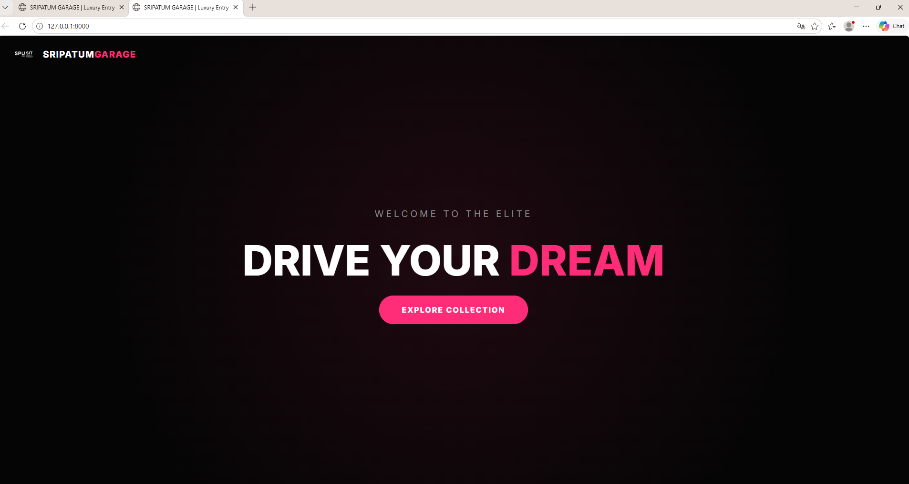
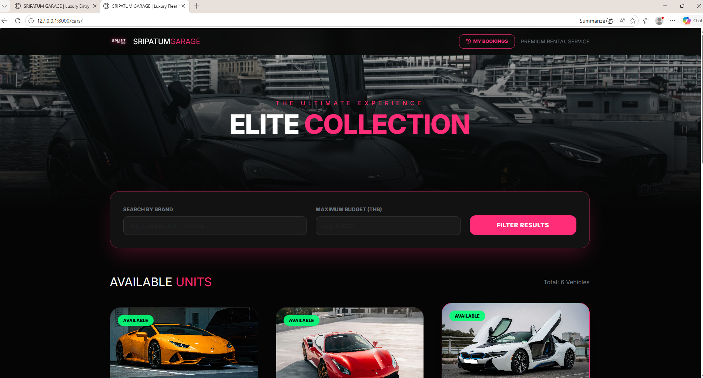
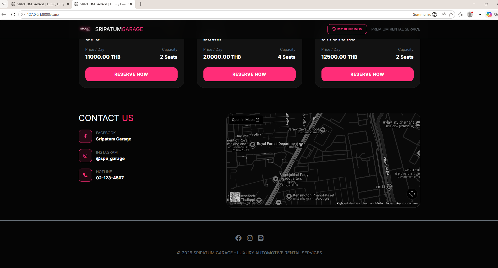
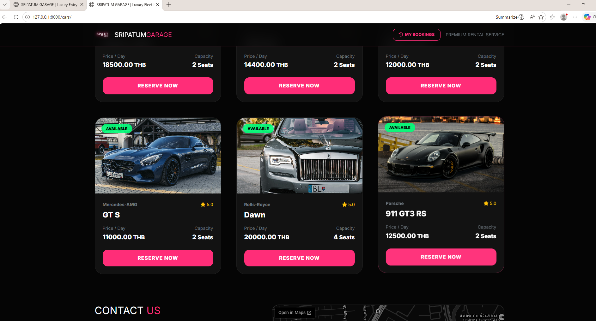
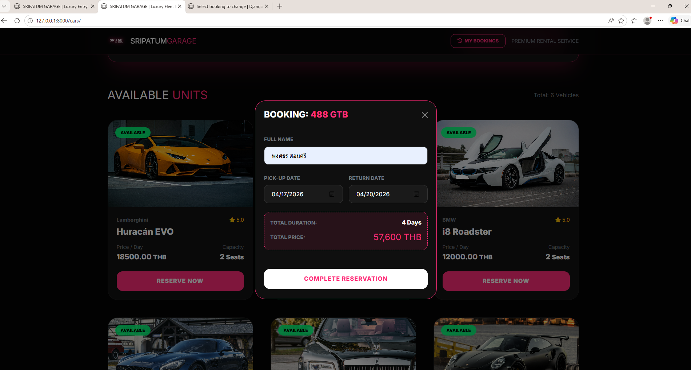
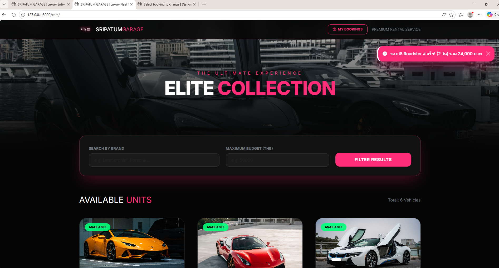
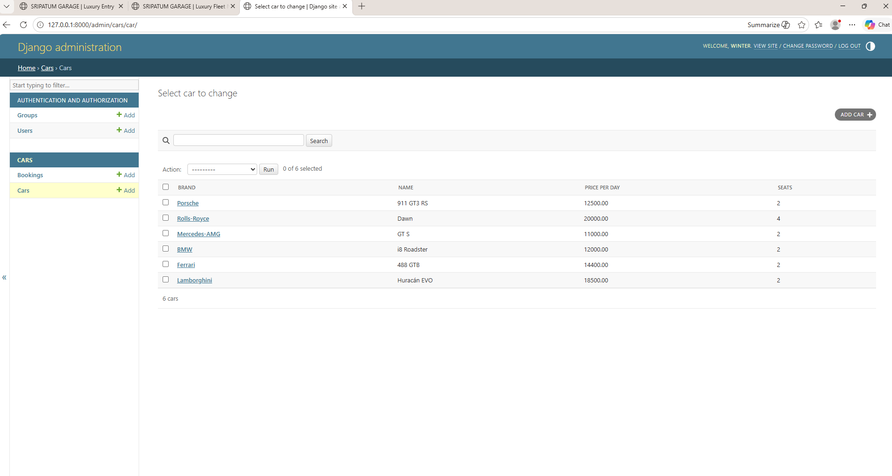
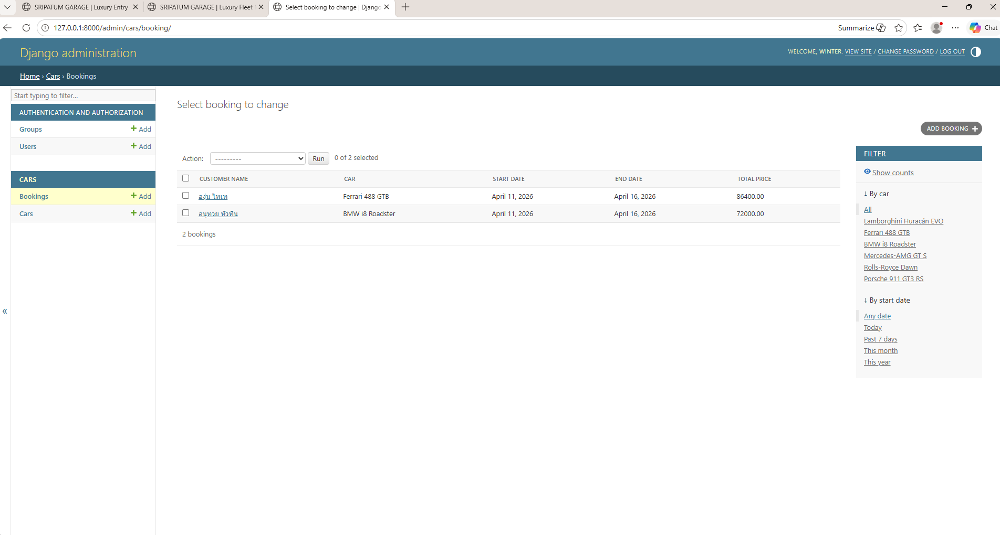

🏎️ SRIPATUM GARAGE - Car Rental System

ยินดีต้อนรับสู่ Sripatum Garage ระบบเช่ารถออนไลน์ระดับพรีเมียม พัฒนาโดยนักศึกษาจากมหาวิทยาลัยศรีปทุม (SPU) หน้าเว็บมาในสไตล์ Dark Mode ตัดด้วยแสงนีออนชมพู ให้ความรู้สึก Modern และ High-end

---

## 👥 ผู้จัดทำ (Developed By)

- นาย พงศภัค เสทิน 68076288  
- นาย บรรณวัชร บุญเปลี่ยม 68083112  
- นางสาว เรืองทอง สุดโต 68077841  
- คณะ: เทคโนโลยีสารสนเทศ (SIT)  
- มหาวิทยาลัย: มหาวิทยาลัยศรีปทุม (SPU)

---

## ✨ Features (ความสามารถของระบบ)

- Car List: แสดงรายการรถทั้งหมดที่พร้อมให้เช่า  
- Booking System: ระบบจองรถผ่าน Modal พร้อมระบบคำนวณวันและเช็กสถานะ  
- My Bookings: หน้าแสดงประวัติการจองรถของผู้ใช้งาน  
- Admin Dashboard: จัดการข้อมูลรถและดูรายการจองทั้งหมดผ่านระบบหลังบ้านของ Django  
- Static & Media: ระบบจัดการรูปภาพพื้นหลังโปรเจกต์และรูปภาพรถที่อัปโหลด  

---

## 🚀 วิธีติดตั้งและรันโปรเจกต์ (How to Install)

### ติดตั้ง Library
pip install -r requirements.txt

### สร้างฐานข้อมูล
python manage.py migrate

### สร้าง Admin
python manage.py createsuperuser

### รันเซิร์ฟเวอร์
python manage.py runserver

---

## 📁 โครงสร้างโฟลเดอร์ที่สำคัญ

- cars/: แอปพลิเคชันหลักของระบบ  
- static/images/: ที่เก็บไฟล์รูปภาพพื้นหลัง  
- media/: ที่เก็บรูปภาพรถที่อัปโหลด  
- templates/: หน้า HTML ทั้งหมดของระบบ  

---

## 📸 ตัวอย่างหน้าจอการทำงาน (Screenshots)

#### 1. หน้าแสดง Welcome (Home Page)

#### 2. หน้าแสดงรายการรถ (Car Inventory)

#### 3. หน้าแสดงการจองสำเร็จ (Booking Success)

#### 4. หน้าจัดการข้อมูลหลังบ้าน (Admin Panel)

